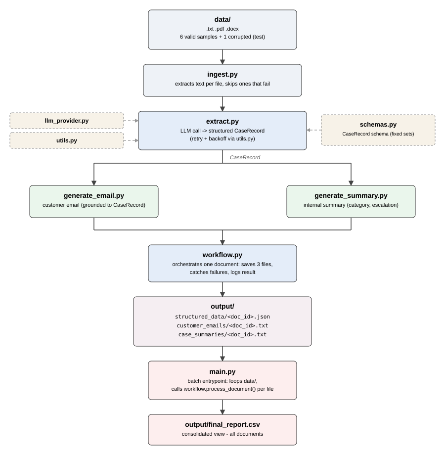

# AI Customer Complaint & Case Processing System

Capstone project for the IIT Patna GenAI Development Program — Project 1: AI-Powered Document Processing & Business Workflow.

## Problem Statement

Businesses that handle customer complaints receive them in different formats (text, PDF, Word docs) and have to manually read each one, figure out what's going on, draft a reply to the customer, and write up an internal case summary for whoever handles the escalation. Doing this by hand for every complaint doesn't scale and is easy to get inconsistent.

## Solution Overview

This project reads a batch of complaint documents from a local folder and runs each one through a small pipeline:

1. **Ingest** the document and pull out the raw text, regardless of whether it's `.txt`, `.pdf`, or `.docx`.
2. **Extract** structured information from the text using an LLM constrained to a fixed schema (customer details, complaint category, issue, resolution status, escalation flag, etc.) — not just a free-text summary.
3. **Generate** two things from that structured data: a professional customer-facing response email, and a separate internal case summary for staff.
4. **Save** everything per document, and build one consolidated CSV covering the whole batch.

The three AI steps (extract → email, extract → summary) are separate, chained calls, not one giant prompt — each one takes the previous step's output as input, so a document only gets analyzed once, and both downstream outputs stay grounded to the same extracted facts.

## Architecture



## Tech Stack

- Python
- LangChain (`langchain-openai`, with `langchain-google-genai` supported as a swappable alternative)
- OpenAI `gpt-4o-mini` for extraction and generation
- Pydantic for the structured extraction schema
- `pdfplumber` / `python-docx` for document parsing
- `pandas` for the consolidated CSV report
- Python's built-in `logging` module

## Project Structure

```
project-1-doc-processing/
├── data/                      # sample input complaint documents (.txt/.pdf/.docx)
├── output/
│   ├── structured_data/       # one JSON per processed document
│   ├── customer_emails/       # one .txt per document
│   ├── case_summaries/        # one .txt per document
│   └── final_report.csv       # consolidated view of all documents
├── config.json                 # provider + model settings
├── .env.example                # template for required env vars
├── llm_provider.py             # provider factory (OpenAI / Gemini)
├── schemas.py                  # Pydantic schema for structured extraction
├── ingest.py                   # document loading + text extraction
├── extract.py                  # LLM call -> structured CaseRecord
├── generate_email.py           # LLM call -> customer response email
├── generate_summary.py         # LLM call -> internal case summary
├── utils.py                    # retry/backoff wrapper for LLM calls
├── workflow.py                 # orchestrates one document end to end
├── main.py                     # batch entrypoint, loops over data/, builds final_report.csv
├── requirements.txt
└── architecture_diagram.svg
```

## Setup

1. Clone the repo and `cd` into `project-1-doc-processing`.
2. Create a virtual environment and activate it:
   ```
   python -m venv venv
   venv\Scripts\Activate.ps1
   ```
3. Install dependencies:
   ```
   pip install -r requirements.txt
   ```
4. Copy `.env.example` to `.env` and fill in your API key:
   ```
   OPENAI_API_KEY=your-actual-key-here
   ```

## Environment Variables

| Variable | Required | Notes |
|---|---|---|
| `OPENAI_API_KEY` | Yes, for the default config (`provider: "openai"` in `config.json`) | |
| `GEMINI_API_KEY` | Only if `config.json`'s `provider` is switched to `"gemini"` | |

## How to Run

Run the whole batch:
```
python main.py
```

This reads every file in `data/`, processes each one through the full pipeline, writes results to `output/`, and prints per-file progress/logging to the console. To run just one document's ingestion, extraction, or generation step in isolation for testing, each module (`ingest.py`, `extract.py`, `generate_email.py`, `generate_summary.py`, `workflow.py`) can also be run directly, e.g. `python extract.py`.

## Sample Data

`data/` contains 6 valid sample complaint documents (2 `.txt`, 2 `.docx`, 2 `.pdf`), covering debt collection, credit card, mortgage, and checking account complaints, with a mix of clearly escalation-worthy and more routine cases. The source narratives are real, anonymized complaints (via the public CFPB Consumer Complaint Database), with synthetic customer contact details added since the public dataset doesn't include any.

`data/` also includes `complaint_007_corrupted.pdf` — a deliberately invalid file, included to demonstrate the ingestion error handling: `load_document()` catches the parse failure, logs it, and the batch continues processing the other 6 documents without crashing.

## Sample Output

For `complaint_001.txt`, the extracted structured record looks like:
```json
{
  "customer_name": "Marcus Reilly",
  "email": "marcus.reilly@example.com",
  "phone_number": "(313) 555-0142",
  "complaint_category": "Debt Collection",
  "issue_description": "Complaint against Waypoint Resource Group LLC for violations of the Fair Debt Collection Practices Act and Fair Credit Reporting Act regarding an unverified debt of $630.00 reported on credit file.",
  "resolution_provided": "No resolution provided yet.",
  "complaint": "Yes",
  "escalation_required": "Yes",
  "supporting_document_available": "Yes",
  "overall_case_status": "Pending"
}
```
The generated customer email and internal case summary for this document are in `output/customer_emails/complaint_001.txt` and `output/case_summaries/complaint_001.txt`. All 6 documents' outputs, plus the combined `output/final_report.csv`, are included in this repo as sample output.

## Key Design Decisions

- **Chained calls instead of one prompt.** Extraction happens once per document and the result is reused for both the email and the summary, instead of asking the LLM to do everything in a single call. This keeps each step's output grounded in the same extracted facts and makes each step independently testable.
- **Pydantic schema, not free-text extraction.** `CaseRecord` forces the LLM's output into the 10 fields the workflow actually needs, with `Literal["Yes","No"]` on the three boolean-style fields, and `Literal` fixed sets on `complaint_category` (plus an `"Other"` fallback) and `overall_case_status`, so downstream code doesn't have to parse or normalize loose text.
- **Retry with backoff on LLM calls.** `utils.py`'s `invoke_with_retry` wraps every `chain.invoke()` call (extraction, email, summary) with up to 3 attempts and linear backoff, so a transient API failure doesn't fail the whole document on the first try.
- **Provider factory pattern.** `llm_provider.py` reads `config.json` and switches between OpenAI and Gemini based on one config value, so the LLM backend isn't hard-coded into the extraction/generation modules.
- **Low temperature (0.3).** This is an extraction/summarization task, not creative writing — lower temperature keeps output more consistent across runs.
- **Per-file error handling in ingestion.** `ingest.py` catches errors per file so one corrupt or unsupported document doesn't stop the whole batch.
- **Customer email deliberately excludes internal-only fields** (`escalation_required`, `complaint_category`) that the internal summary includes — the two generation prompts are given different subsets of the extracted data on purpose.

## Limitations

- Retries are per-call, not per-document — if a document fails after exhausting all 3 retries (e.g. a sustained outage), that document is logged and skipped for the rest of the batch, not retried as a whole later.
- Batch processing is sequential, not parallel — processing time scales linearly with the number of documents.
- Every run reprocesses the entire `data/` folder from scratch — there's no tracking of which documents were already processed.
- The generated customer email is saved to a file, not actually sent anywhere.
- Sample data is synthetic/anonymized, not real production complaint data.
